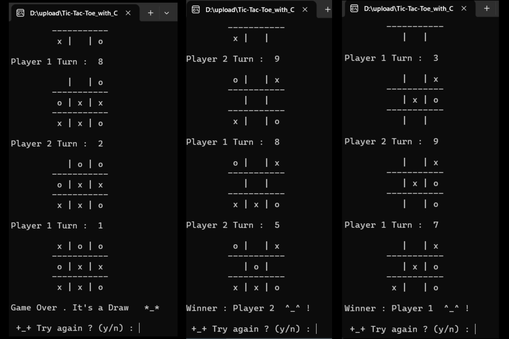

# Tic-Tac-Toe_with_C
Tic-Tac-Toe game in C programming and it is two player game, not player and computer.

# Notes :-
```bash
* Project - Tic Tac Toe Game. non-officially assign on 23 september 2024. completed on 18 October 2024.
*   Conditional Requirements as follow :-
*   1. Game should state play rules first and show a basic board.
*   2. input can't be taken in pattern so give user ability to chose positions.
*   3. make methods for initialize, turns, score and reset.
*   4. repeat that game after every draw , win or lose.
*
*   changes have been made advice to use global.(issue for passing in function.)
*   make a counter ps_ctr for multidimensional loop. and compare with pos entered.
*   counter ps_ctr is in conflict with while x coz of same repeating position.(removed from while. solved)
*   don't use negate, gives negative value , not required.
*
*
```
# Example Image

1. Game Begin.


2. End Game.



# checks Includes :-

```bash
1. Player 1 wins
2. Player 2 wins
3. Game Draw
```
